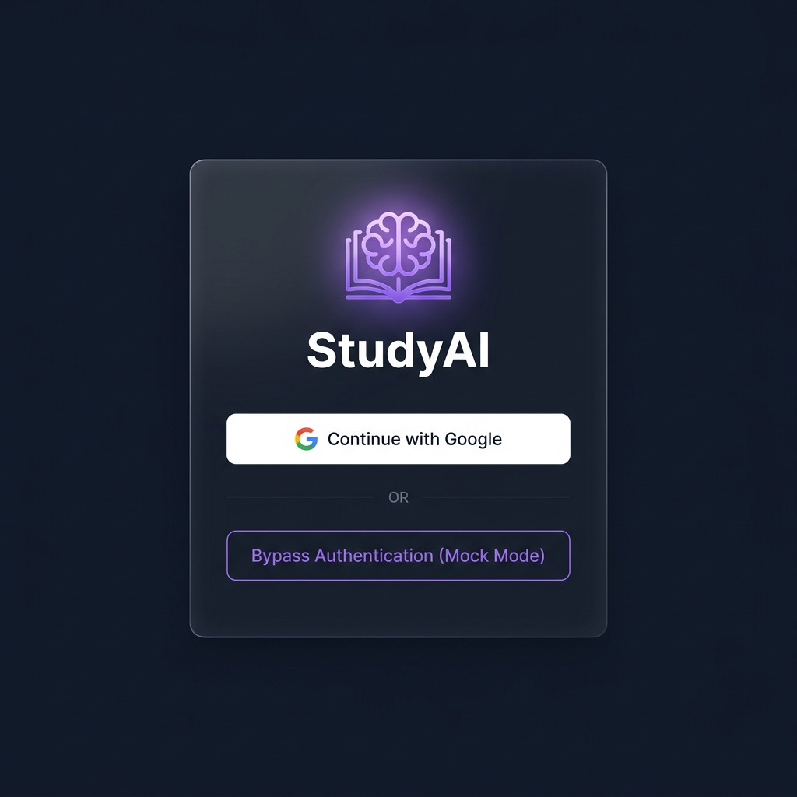
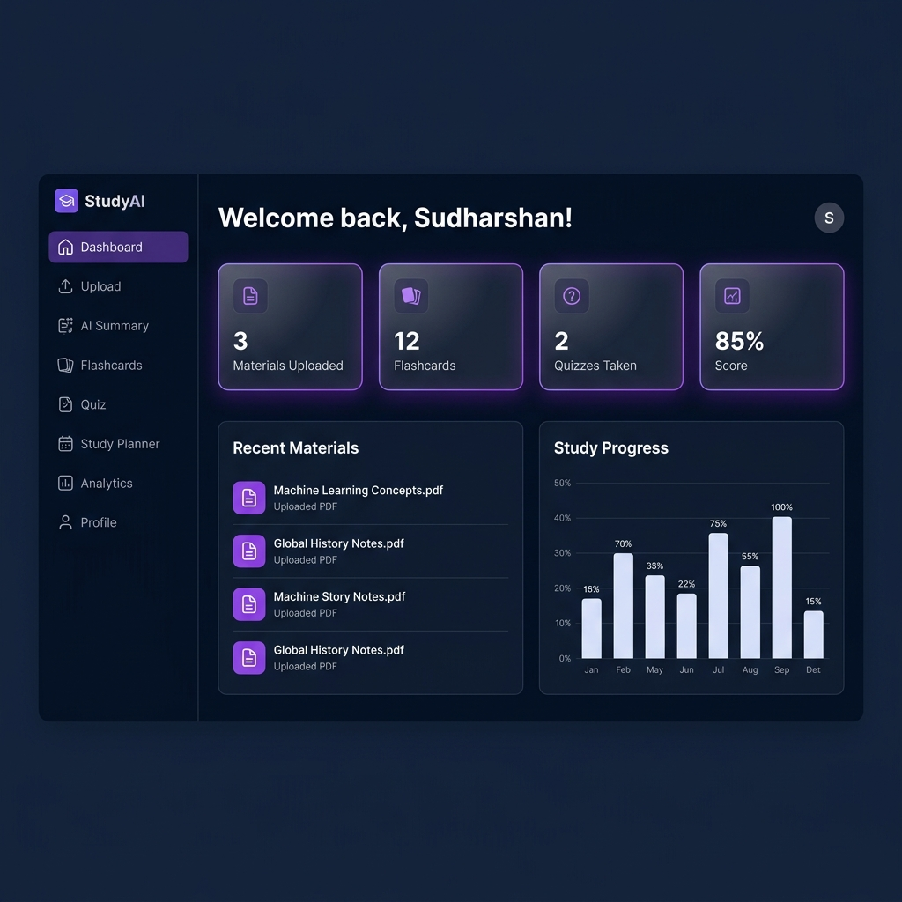
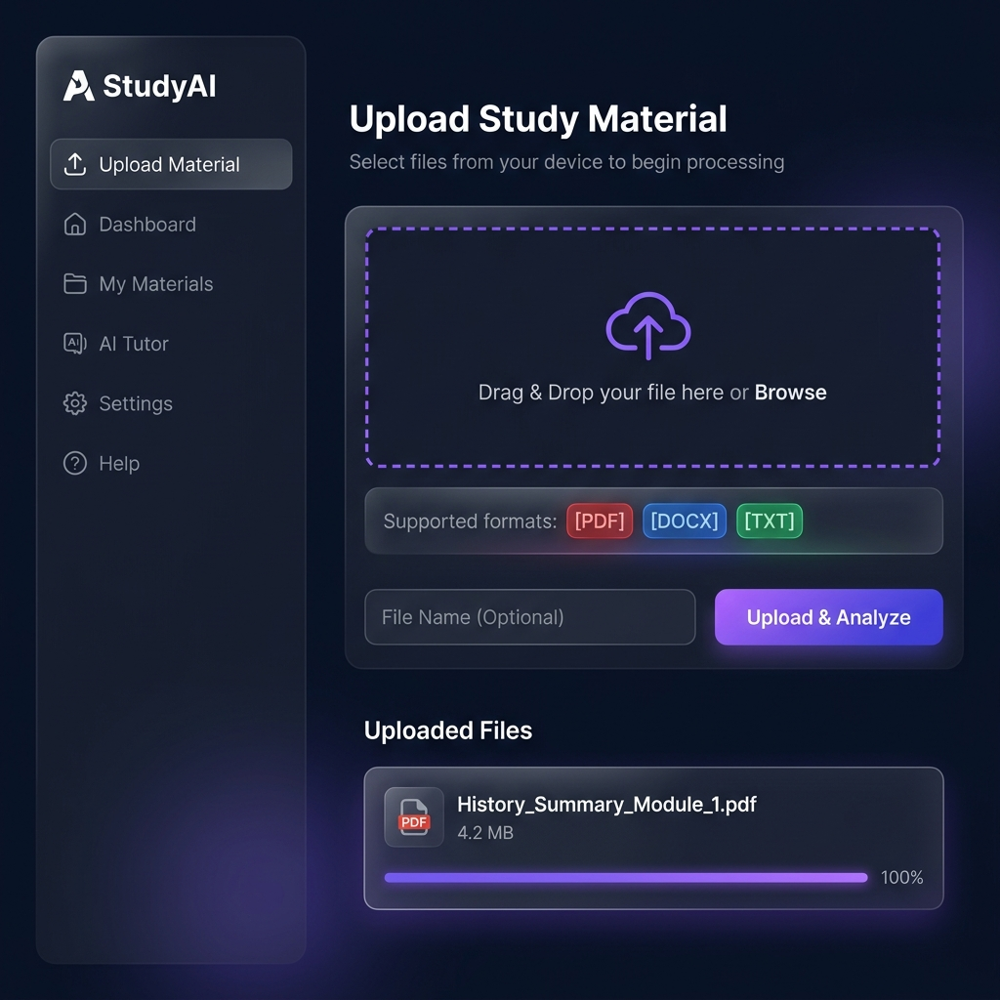
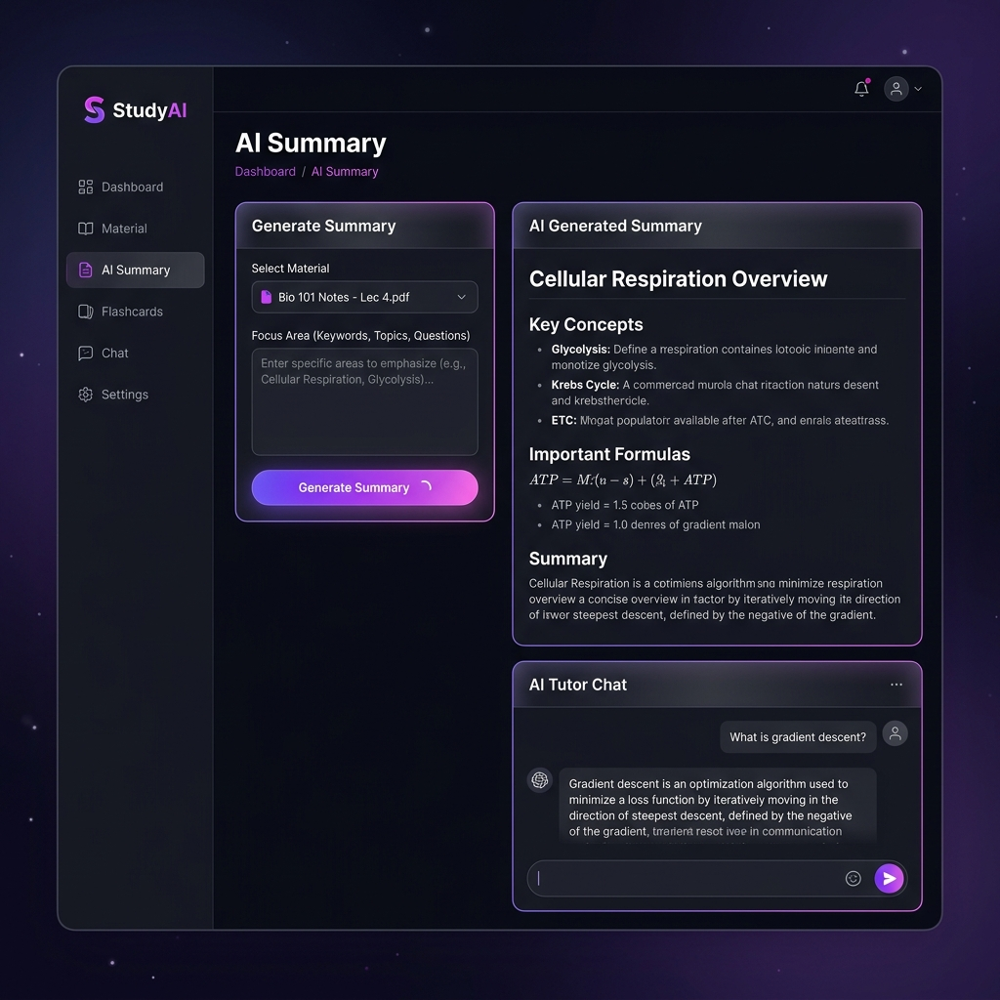
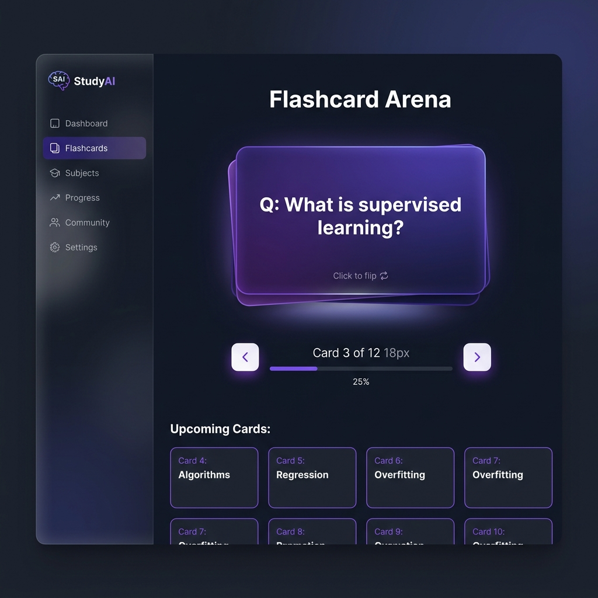
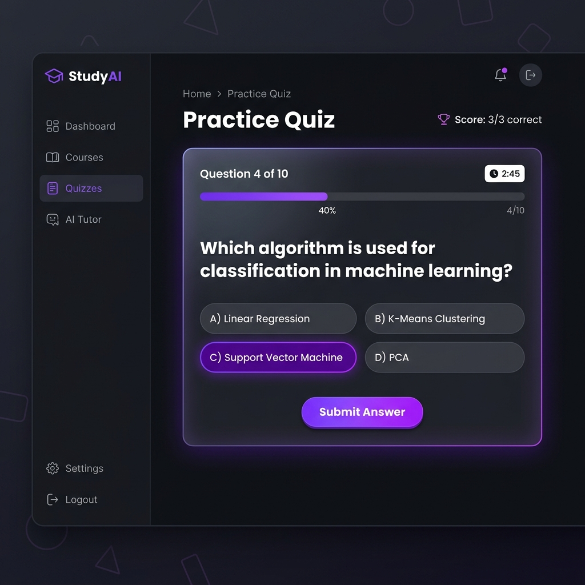
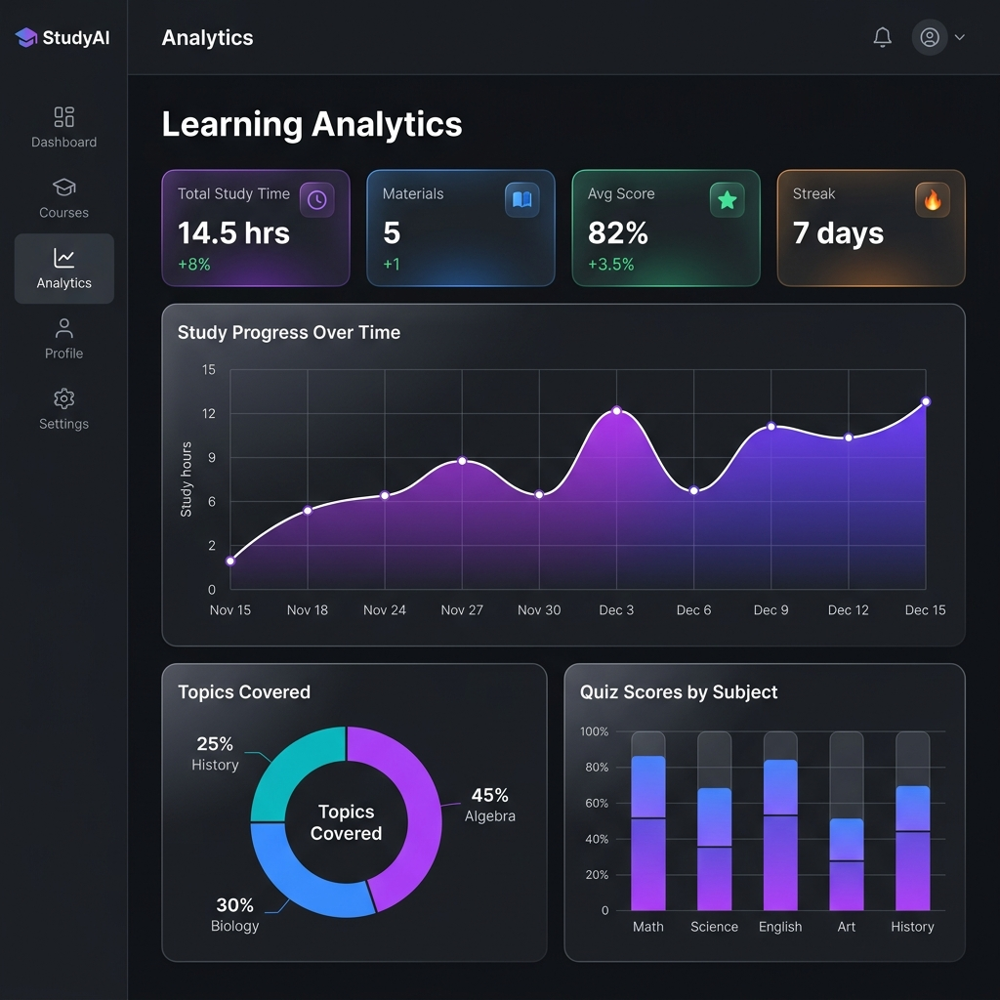
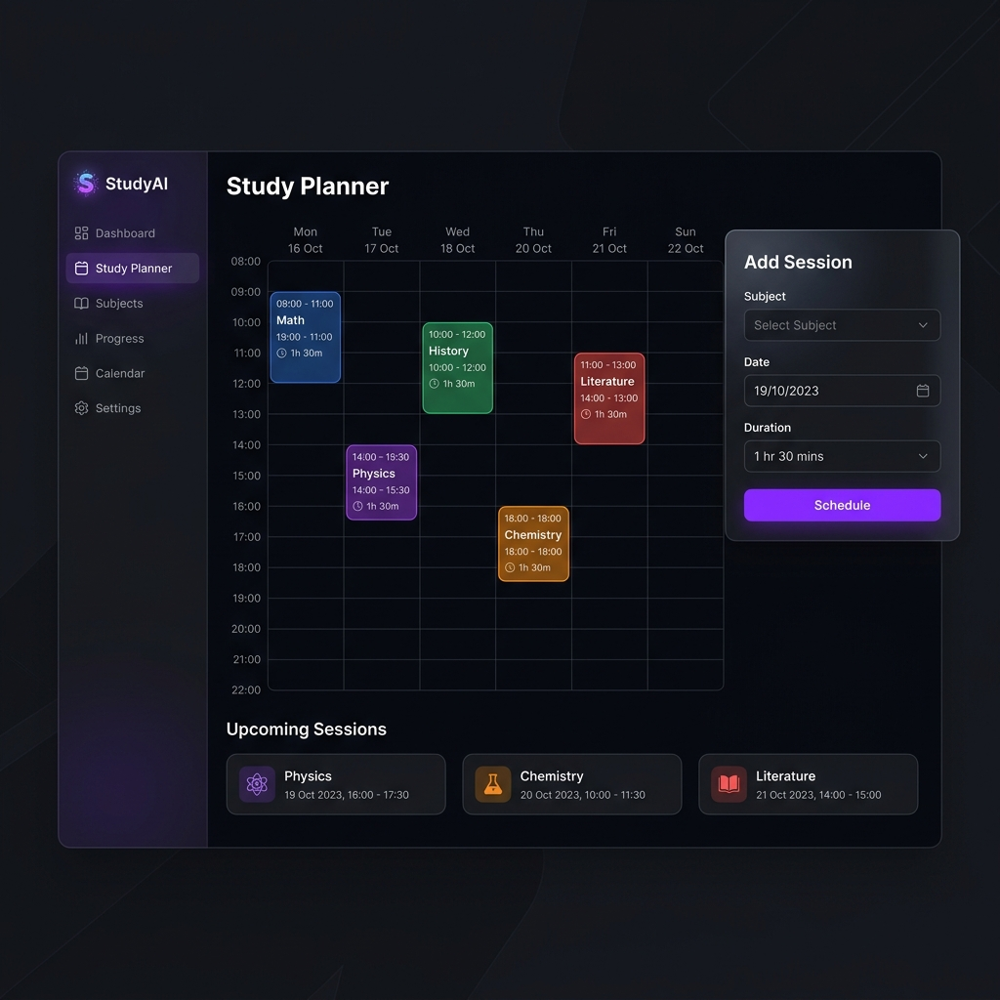
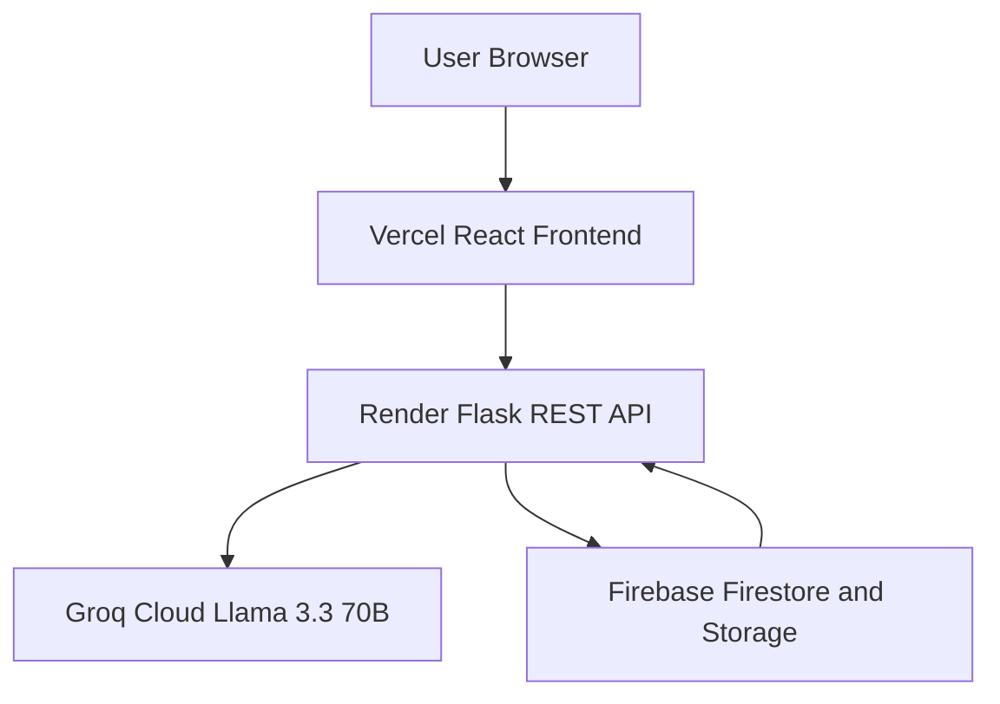
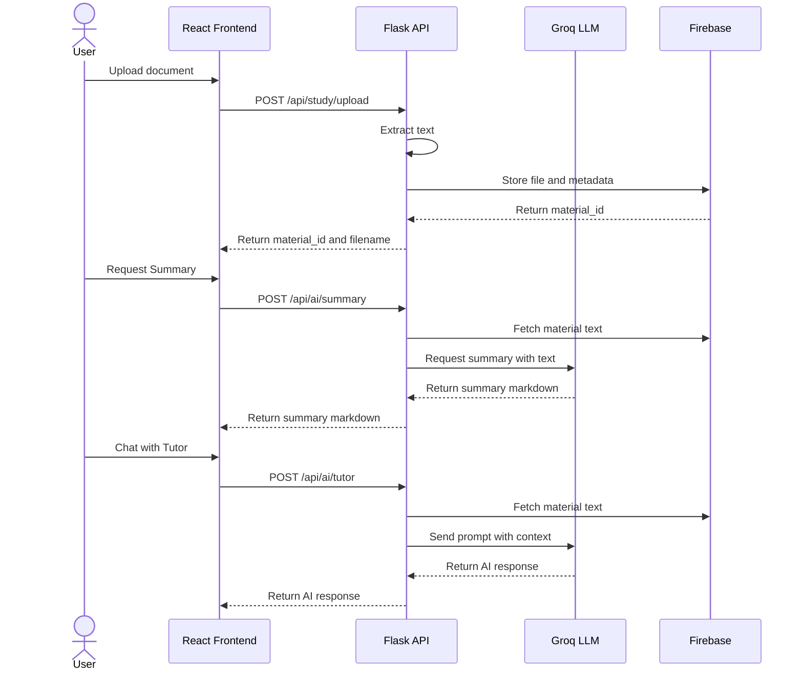

<div align="center">

# 🧠 StudyAI — AI-Powered Personal Study Assistant

**Transform your study materials into an intelligent learning experience powered by Groq's Llama 3.3 70B.**

[](https://react.dev)
[](https://flask.palletsprojects.com)
[](https://firebase.google.com)
[](https://groq.com)
[](https://vite.dev)
[](https://python.org)
[](LICENSE)
[](https://study-ai-woad-one.vercel.app)
[](https://studyai-api-m2o0.onrender.com)

<br/>

**[🚀 Live Demo](https://study-ai-woad-one.vercel.app)** &nbsp;|&nbsp; **[📡 Backend API](https://studyai-api-m2o0.onrender.com)** &nbsp;|&nbsp; **[📂 GitHub](https://github.com/SUDHARSHANKUPPILI/StudyAI)**

</div>

---

## 📸 Application Preview

### 🔐 Login Page


### 📊 Dashboard


### 📤 Upload Material


### 🤖 AI Summary & Tutor


### 🃏 Flashcard Arena


### 📝 Practice Quiz


### 📈 Learning Analytics


### 🗓️ Study Planner


---

## 📖 About

**StudyAI** is a full-stack AI-powered learning platform that transforms raw study materials (PDF, DOCX, TXT) into structured learning assets using Large Language Models. It provides students with an end-to-end study toolkit — from intelligent document summarization to interactive quizzes, active recall flashcards, a context-aware AI Tutor chatbot, progress analytics, and a personal study planner.

Built with a **Flask** REST API backend powered by **Groq's Llama 3.3 70B** model, a **React 19 + Vite** frontend, and **Firebase** for cloud storage and Firestore database persistence.

---

## ✨ Features

| Feature | Description |
|---------|-------------|
| 📄 **Document Ingestion** | Upload PDF, DOCX, and TXT files with text extraction and complete secure document deletion |
| 🧠 **AI Study Summary** | Generates structured study guides with focus-area steering (Key Concepts, Formulas, etc.) |
| 💬 **Context-Aware AI Tutor** | Conversational chatbot that reads your uploaded document and answers questions contextually |
| 🃏 **Flashcard Generator** | Auto-generates active-recall flip card decks from your material |
| 📝 **Quiz Generator** | Creates multiple-choice practice quizzes with instant feedback |
| 📈 **Learning Analytics** | Tracks study sessions, quiz scores, and visualizes progress over time |
| 🗓️ **Study Planner** | AI-recommended weekly study schedules based on uploaded materials |
| 🔐 **Secure Auth** | JWT-based authentication with Firebase backend integration |
| ☁️ **Cloud Storage** | Materials stored in Storage; deleting a document cascade-purges summaries, flashcards, quizzes, and analytics |

---

## 🛠️ Technology Stack

### Backend
| Technology | Purpose |
|------------|---------|
| Python 3.11 | Runtime |
| Flask 3.0 | REST API framework |
| Groq SDK + Llama 3.3 70B | AI text generation |
| Firebase Admin SDK 6.5 | Firestore DB + Cloud Storage |
| Pydantic 2.7 | Request/response schema validation |
| Gunicorn 22 | Production WSGI server |
| PyPDF + python-docx | Document parsing |

### Frontend
| Technology | Purpose |
|------------|---------|
| React 19 | UI framework |
| Vite 8 | Build tool & dev server |
| Axios | HTTP client |
| Framer Motion | Animations |
| Marked | Markdown rendering |
| Chart.js + react-chartjs-2 | Analytics charts |
| Lucide React | Icon library |

### Infrastructure
| Service | Purpose |
|---------|---------|
| Render | Flask backend deployment |
| Vercel | React frontend deployment |
| Firebase Firestore | NoSQL database |
| Firebase Storage | File storage |
| GitHub | Version control |

---

## 🏗️ System Architecture



---

## 🔄 Data Flow Diagram



---

## 📁 Folder Structure

```
StudyAI/
├── backend/                        # Flask REST API
│   ├── app.py                      # Application factory & Firebase init
│   ├── run.py                      # Entry point (gunicorn run:app)
│   ├── config.py                   # Environment-aware configuration
│   ├── requirements.txt            # Python dependencies
│   ├── runtime.txt / .python-version  # Python 3.11.9 pin for Render
│   ├── config/
│   │   └── firebase-key.json       # 🔒 Git-ignored service account key
│   ├── models/
│   │   └── schemas.py              # Pydantic request/response schemas
│   ├── routes/
│   │   ├── auth.py                 # Authentication endpoints
│   │   ├── upload.py               # File upload & processing
│   │   ├── summary.py              # AI summary + tutor chat
│   │   ├── flashcards.py           # Flashcard generation
│   │   ├── quiz.py                 # Quiz generation
│   │   ├── schedule.py             # Study planner
│   │   └── analytics.py           # Learning analytics
│   ├── services/
│   │   ├── groq_service.py         # Groq LLM integration
│   │   ├── firebase_service.py     # Firestore + Storage operations
│   │   ├── file_service.py         # Document text extraction
│   │   └── analytics_service.py   # Analytics computation
│   ├── prompts/                    # LLM prompt templates
│   └── utils/                     # Decorators, error handlers, helpers
│
├── frontend/                       # React + Vite SPA
│   ├── index.html
│   ├── vite.config.js
│   ├── vercel.json                 # SPA routing config for Vercel
│   ├── .env.production             # Production API URL
│   └── src/
│       ├── App.jsx                 # Root component & router
│       ├── main.jsx
│       ├── pages/                  # Full page components
│       │   ├── LoginPage.jsx
│       │   ├── DashboardPage.jsx
│       │   ├── UploadMaterialPage.jsx
│       │   ├── AISummaryPage.jsx
│       │   ├── FlashcardsPage.jsx
│       │   ├── QuizPage.jsx
│       │   ├── AnalyticsPage.jsx
│       │   ├── StudyPlannerPage.jsx
│       │   └── ProfilePage.jsx
│       ├── services/               # Axios API clients
│       ├── hooks/                  # Custom React hooks
│       ├── components/             # Reusable UI components
│       ├── context/                # React context providers
│       └── layouts/                # App shell & navigation
│
├── docs/
│   └── screenshots/               # Application screenshots
├── render.yaml                    # Render Blueprint deployment config
└── README.md
```

---

## ⚡ Quick Start — Local Development

### Prerequisites
- Python 3.11+
- Node.js 18+
- A [Groq API key](https://console.groq.com/) (free tier available)
- A [Firebase project](https://console.firebase.google.com/) with Firestore and Storage enabled

### 1. Clone the Repository
```bash
git clone https://github.com/SUDHARSHANKUPPILI/StudyAI.git
cd StudyAI
```

### 2. Backend Setup
```bash
cd backend

# Create virtual environment
python -m venv venv
venv\Scripts\activate        # Windows
# source venv/bin/activate   # macOS/Linux

# Install dependencies
pip install -r requirements.txt

# Configure environment variables
cp .env.example .env
```

Edit `backend/.env`:
```env
GROQ_API_KEY=your_groq_api_key_here
FLASK_ENV=development
SECRET_KEY=your_secret_key_here
FIREBASE_STORAGE_BUCKET=your-project.firebasestorage.app
```

Download your Firebase service account key and save it to:
```
backend/config/firebase-key.json
```

Start the Flask server:
```bash
python run.py
# → Running on http://127.0.0.1:5000
```

### 3. Frontend Setup
```bash
cd frontend

# Install dependencies
npm install

# Start development server
npm run dev
# → Running on http://localhost:5173
```

---

## 🔑 Environment Variables

### Backend (`backend/.env`)

| Variable | Required | Description |
|----------|----------|-------------|
| `GROQ_API_KEY` | ✅ | Groq API key for Llama 3.3 70B access |
| `FLASK_ENV` | ✅ | `development` or `production` |
| `SECRET_KEY` | ✅ | Flask session secret key |
| `FIREBASE_STORAGE_BUCKET` | ✅ | Firebase Storage bucket name |
| `FIREBASE_CREDENTIALS_PATH` | ⬜ | Path to service account JSON (default: `config/firebase-key.json`) |
| `FIREBASE_CREDENTIALS_JSON` | ⬜ | Full JSON string of service account (for Render/production) |
| `ALLOWED_CORS_ORIGINS` | ⬜ | Comma-separated CORS origins (default: `*`) |
| `PORT` | ⬜ | Server port (default: `5000`) |

### Frontend (`frontend/.env.production` or Vercel Environment Variables)

| Variable | Required | Description |
|----------|----------|-------------|
| `VITE_API_BASE_URL` | ✅ | Backend API base URL (e.g. `https://studyai-api.onrender.com`) |
| `VITE_FIREBASE_API_KEY` | ✅ | Firebase Web API key |
| `VITE_FIREBASE_AUTH_DOMAIN` | ✅ | Firebase Auth domain (e.g. `project-id.firebaseapp.com`) |
| `VITE_FIREBASE_PROJECT_ID` | ✅ | Firebase Project ID |
| `VITE_FIREBASE_STORAGE_BUCKET` | ✅ | Firebase Storage bucket (e.g. `project-id.appspot.com`) |
| `VITE_FIREBASE_MESSAGING_SENDER_ID` | ✅ | Firebase Messaging Sender ID |
| `VITE_FIREBASE_APP_ID` | ✅ | Firebase Web App ID |
| `VITE_FIREBASE_MEASUREMENT_ID` | ✅ | Firebase Google Analytics Measurement ID |

---

## 📡 API Endpoints

### Authentication
| Method | Endpoint | Description |
|--------|----------|-------------|
| `POST` | `/api/auth/login-mock` | Demo login (development) |
| `GET` | `/api/auth/session` | Verify session token |

### Study Materials
| Method | Endpoint | Description |
|--------|----------|-------------|
| `POST` | `/api/study/upload` | Upload and parse a document |
| `GET` | `/api/study/materials` | List all uploaded materials |
| `DELETE` | `/api/study/materials/:id` | Delete a material |

### AI Features
| Method | Endpoint | Description |
|--------|----------|-------------|
| `POST` | `/api/ai/summary` | Generate AI study summary |
| `POST` | `/api/ai/tutor` | Chat with context-aware AI Tutor |
| `POST` | `/api/ai/flashcards` | Generate flashcard deck |
| `POST` | `/api/ai/quiz` | Generate practice quiz |

### Analytics & Planner
| Method | Endpoint | Description |
|--------|----------|-------------|
| `GET` | `/api/study/analytics` | Fetch learning analytics |
| `GET` | `/api/study/schedule` | Fetch study plan |
| `POST` | `/api/study/schedule` | Create/update study plan |

### Health
| Method | Endpoint | Description |
|--------|----------|-------------|
| `GET` | `/health` | Backend health check |

---

## 🔒 Security Architecture

StudyAI enforces **multi-tenant data isolation** — every user can only access their own data.

| Layer | Protection |
|---|---|
| **Authentication** | Firebase Google Sign-In + Backend ID token verification |
| **Data Ownership** | Every Firestore document tagged with `ownerUid` |
| **Query Scoping** | All read queries filter by `ownerUid == authenticated_uid` |
| **Write Verification** | All updates verify document ownership before modifying |
| **Storage Isolation** | File uploads stored at `uploads/{uid}/{filename}` |
| **AI Endpoints** | Material ownership verified before generating summaries, flashcards, or quizzes |

> See [SECURITY.md](SECURITY.md) for the full security policy and implementation details.

---

## 🚀 Deployment Guide

### Backend → Render

1. Push your code to GitHub
2. Go to [Render Dashboard](https://dashboard.render.com/) → **New Blueprint**
3. Connect your `StudyAI` repository — Render auto-reads `render.yaml`
4. Set these environment variables in the Render Dashboard:
   - `GROQ_API_KEY`
   - `FIREBASE_STORAGE_BUCKET`
   - `FIREBASE_CREDENTIALS_JSON` ← paste entire contents of `firebase-key.json`
5. Click **Apply** → backend deploys at `https://studyai-api-xxxx.onrender.com`

### Frontend → Vercel

1. Go to [Vercel](https://vercel.com/) → **New Project** → Import `StudyAI` repository
2. Configure:
   - **Root Directory**: `frontend`
   - **Framework**: `Vite`
   - **Build Command**: `npm run build`
   - **Output Directory**: `dist`
3. Add environment variable: `VITE_API_BASE_URL=https://studyai-api-xxxx.onrender.com`
4. Click **Deploy** → frontend deploys at `https://your-app.vercel.app`

---

## 🔮 Future Enhancements

- [x] 🔐 Firebase Google Authentication
- [x] 🛡️ Multi-tenant data isolation (ownerUid enforcement)
- [ ] 🌍 Multi-language support (i18n)
- [ ] 📱 Progressive Web App (PWA) support
- [ ] 🎯 Spaced Repetition System (SRS) for flashcards
- [ ] 🤝 Collaborative study rooms
- [ ] 📊 Detailed per-topic weakness analysis
- [ ] 🔔 Study session reminders via email/push notifications
- [ ] 📲 React Native mobile app

---

## 👨‍💻 Contributors

<table>
  <tr>
    <td align="center">
      <b>Sudharshan Kuppili</b><br/>
      <sub>Full Stack Developer & AI Integration</sub><br/>
      <a href="https://github.com/SUDHARSHANKUPPILI">@SUDHARSHANKUPPILI</a>
    </td>
  </tr>
</table>

---

## 📄 License

This project is licensed under the **MIT License** — see the [LICENSE](LICENSE) file for details.

---

<div align="center">

Built with ❤️ using **Flask**, **React**, **Groq AI**, and **Firebase**

⭐ **Star this repository** if you found it helpful!

</div>
